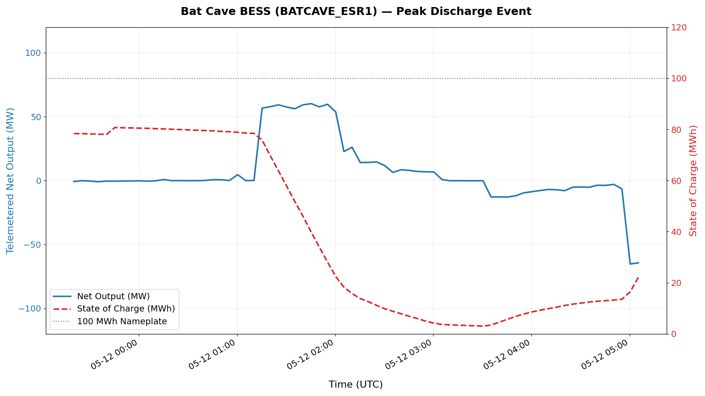
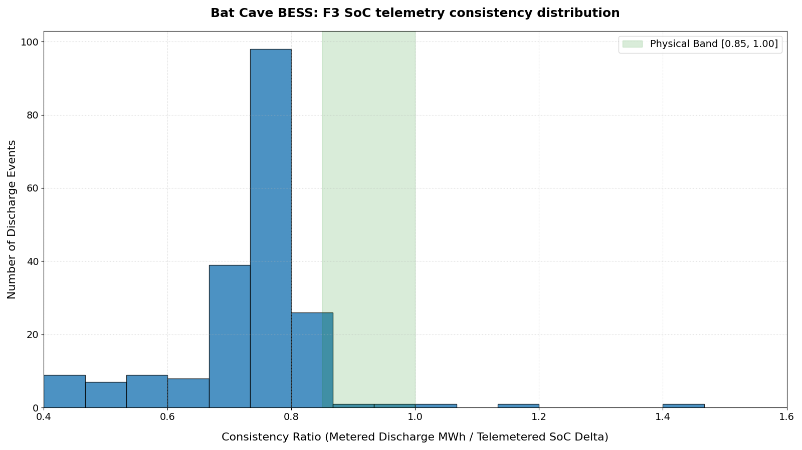

# ERCOT Bat Cave BESS Independent Audit (US-TX-BATC-001)

Independent verification of the public nameplate claims of the Bat Cave battery energy storage system (Developed by Broad Reach Power, acquired by ENGIE; resource `BATCAVE_ESR1`, Mason County, TX) — **100 MW / 100 MWh** — from ERCOT SCED 60-day disclosure telemetry, under the VolMax P10 Verification Protocol (v1.2).

**Audit window:** 19 March 2026 – 17 May 2026, 5-minute SCED intervals (~17,500 records).

## Limitations first

1. **Operator-reported SoC.** State of Charge (SoC) is operator-reported state estimation from telemetry, not an independent physical measurement.
2. **5-minute resolution floor.** Sub-interval dynamics are not observable; maximum power findings are 5-minute telemetry values.
3. **Pre-registration scoping compromise.** The pre-registered F4 hypothesis framing contained a scoping error (L0 scoping error in `audits/US-TX-BATC-001/failures.md`). The F4 test is compromised and the verdict is deferred.
4. **Geo-Restricted Access.** ERCOT MIS portal access is geo-restricted to US IP ranges. Raw filtered telemetry data is archived directly in this repository under `audits/US-TX-BATC-001/raw_data/` to ensure full reproducibility independent of geographic location.

## Verdict ledger

| Rule | Claim | Verdict | Key evidence |
|---|---|---|---|
| F1 | 100 MW power capacity | **Not Demonstrated** (Bounded) | Max physical output peaked at 72.61 MW under SCED limits. High Sustainable Limit (HSL) telemetry confirms model capacity at 100.0 MW, but the asset was never dispatched to nameplate capacity. |
| F2 | 100 MWh energy capacity | **Not Demonstrated** (Not Verified) | Largest continuous net discharge block was 58.0 MWh. When instructed to fully charge (Base Point <= LSL < 0), the starting SoC of the subsequent discharge blocks never exceeded 75.54 MWh. |
| F3 | SoC telemetry internal consistency | **Inconsistent** | Only 1.22% of events meet naive thermodynamic range [0.85, 1.0] (mean: 0.6339). Deviation likely reflects physical losses/auxiliary loads or column semantics. |
| F4 | SoC field interpretation | **Deferred** | Max observed `max_soc` peaked at 102.95 MWh. Verdict is deferred pending official ERCOT column schemas. |

### Visualized Findings

#### Panel 1 — Peak Discharge Event (58.0 MWh Continuous Discharge)

#### Panel 2 — F3 Telemetry Consistency Distribution (F3 Histogram)

## Reproducibility

- `audit_batcave.py` — single entry point; regenerates `audits/US-TX-BATC-001/metrics.json` and `findings.md`.
- `cross_validate_datasets.py` — performs cell-by-cell cross-validation of raw ERCOT direct files against Grid Status API rendering.
- `get_ercot_stats.py` — reproduces high-level telemetry statistics.
- `pull_batcave.py` — scripts used to fetch primary telemetry chunks.

## Citation

Nestorov, Ivan (VolMax Studio Lab). *ERCOT Bat Cave BESS Independent Audit (US-TX-BATC-001).* VolMax P10 Verification Protocol v1.2. DOI: [10.5281/zenodo.21401795](https://doi.org/10.5281/zenodo.21401795).

---
*VolMax Studio Lab · Independent verification of battery & energy-storage claims · [volmax-studio.rs](https://volmax-studio.rs)*
